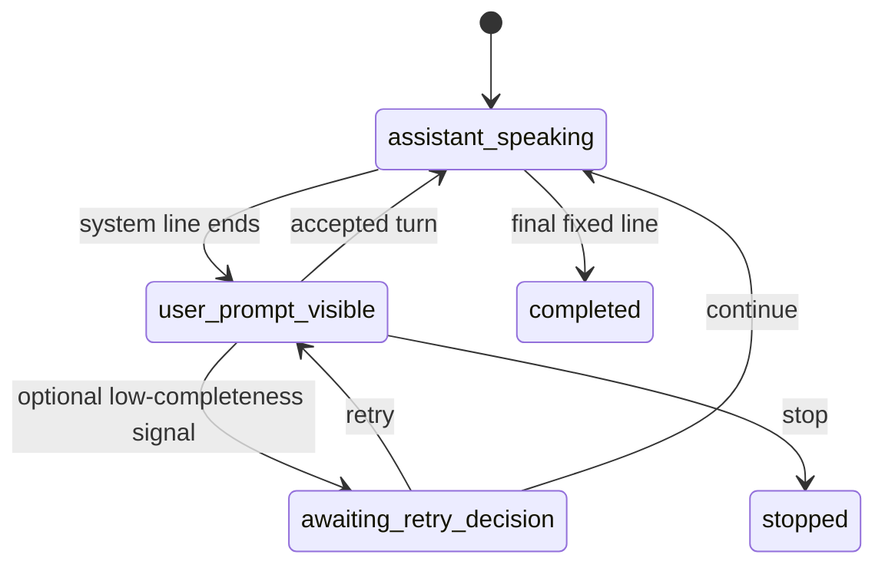

# Guided Conversations v0.1

Release: 0.5.0
Engine: `guided-engine-v0.1`
Content: `guided-content-v1`
Fluency: `fluency-v0.1`

## Product boundary

Guided Conversations is deterministic role-play practice. The learner sees an exact line,
reads it aloud, and hears the next fixed character line. It measures performance while reading
a known script: pronunciation, temporal delivery, completion, retries, and task-specific
self-confidence. It does not measure unrestricted language generation and cannot issue, promote,
or change a CEFR placement.

The placement assessment remains the only authority for `current_cefr_level`. The trusted
application backend supplies the persisted placement level to this service; a browser must never
supply an authoritative level or receive the service credential.

## Included catalog and access policy

| Scenario ID | Theme | Required level | Learner turns |
| --- | --- | ---: | ---: |
| `cafe.order_drink.a1` | Café | A1 | 6 |
| `restaurant.order_meal.a1` | Restaurant | A1 | 6 |
| `restaurant.wrong_order.b1` | Restaurant | B1 | 8 |

Scenarios at or below the learner's persisted placement are unlocked. Higher scenarios remain in
catalog responses with `is_locked=true`, but both detailed preview and session creation return HTTP
403. An incomplete placement locks all scenarios.

Content lives in `services/guided_conversation/content`. Each immutable scenario stores its
version, roles, objective, useful vocabulary, fixed system text, exact displayed/expected learner
text, expected pause boundaries, target words, and target phonemes. Run
`python tools/validate_scenarios.py`; `_scenario_schema.json` is the generated JSON Schema.

## Deterministic state machine



At the last turn, accepted or continued progression enters `completed` and plays the scenario's
fixed closing line. All transitions are persisted with optimistic revision checks and audit events.
Attempt POSTs are idempotent. A retry retains earlier attempts but sets only the final attempt for
that turn as `selected`; reports aggregate selected attempts.

ASR transcript similarity is an auxiliary completeness signal only. Below 0.55 completion, the
service may offer at most two retries. The learner can always continue. An ASR mismatch is never a
pronunciation diagnosis and never changes access or placement.

## LiveKit runtime

The existing `english-tutor` worker branches before creating the free-conversation LLM pipeline.
The application backend calls `POST /v1/practice-sessions` with `mode=guided`.
The returned short-lived LiveKit token explicitly dispatches `english-tutor`
with trusted job metadata:

```json
{
  "conversation_mode": "guided",
  "guided_session_id": "guided-7e3..."
}
```

Job metadata is authoritative; pre-existing integrations may use the same JSON
as room metadata during migration. The runtime fetches every fixed line from the service. Its LiveKit scheduler dependency is a local
disabled adapter with no provider, credentials, network path, or generation method; any unexpected
attempt to invoke it raises an error. Normal guided progression therefore makes no Gemini,
OpenAI, or other LLM request.

The worker publishes UTF-8 JSON on reliable topic `guided.events`:

- `guided.session_ready`
- `guided.learner_prompt_active`
- `guided.turn_evaluated`
- `guided.retry_ready`
- `guided.continued`
- `guided.line_replayed`
- `guided.completed`
- `guided.stopped`
- `guided.error`

The browser publishes `{"command":"..."}` on reliable topic `guided.command`. Supported commands
are `retry`, `continue`, `replay`, `replay_slow`, and `stop`. Microphone enablement is the browser's
Start Speaking control. The backend/API remains authoritative for state; LiveKit data is a UI
notification transport, not a durable record.

## Audio and pronunciation

Enhanced audio feeds Flux for word timing, speech start/end, and the auxiliary transcript. When the
learner grants recording consent, the original pre-enhancement segment is encrypted and stored for
the attempt. Without consent, no raw guided audio is uploaded and pronunciation remains
`not_requested`.

When `PRONUNCIATION_SERVICE_URL` and `PRONUNCIATION_SERVICE_TOKEN` are configured and raw audio is
available, the service posts `guided.pronunciation_requested` to
`POST {PRONUNCIATION_SERVICE_URL}/v1/pronunciation/jobs`. It supplies the known reference text,
target words/phonemes, internal audio URI, stable event ID, and callback URL. The external worker
calls `POST /v1/guided-conversations/pronunciation/callback` with a completed or failed event.

This job is asynchronous. Queue failure, evaluation failure, or a pending result never blocks the
next fixed turn. Deployments using local encrypted storage must give the pronunciation worker a
secure retrieval path; distributed deployments should use the existing encrypted S3 backend or a
separate authorized retrieval broker.

## Guided-speaking fluency and delivery

Each selected turn is sent through the same `fluency-v0.1` feature extractor and scorer used by
assessment and conversation, under isolated mode `guided`. It derives speech/articulation rate,
pause behavior, continuity, repair/disfluency evidence, eligibility, evidence confidence, and the
explainable fluency index. The guided report overrides the interpretation to state that the index
describes this oral-reading scenario; the model validator prohibits CEFR output outside assessment.

Delivery stability separately reports:

- mean prompt-to-speech time;
- expected-line completion ratio;
- mid-phrase versus expected-boundary pauses;
- retry count; and
- turns completed without retry.

The label is `stable`, `developing`, or `needs_more_evidence`. It is observable delivery, not a
claim about psychological confidence. Before and after 0–100 values are stored only as learner
self-report, with a simple difference in the final report.

## Privacy and persistence

The durable guided attempt stores a transcript SHA-256, derived fluency/delivery results,
pronunciation state, selected-attempt flag, versions, and optional encrypted audio URI. It does not
store the transcript or word timestamps in the guided session or idempotency replay JSON. Raw
audio follows the existing consent, encryption, retention, and cleanup controls.

SQLite and PostgreSQL schema changes are in migration `003`. Every report retains content, engine,
fluency, delivery, and pronunciation versions so later releases do not reinterpret old sessions.

## API sequence

All `/v1` calls require `Authorization: Bearer <ASSESSMENT_SERVICE_TOKEN>` and are made by the BFF.

1. `GET /v1/guided-conversations/scenarios?placement_completed=true&placement_level=A1`
2. `GET /v1/guided-conversations/scenarios/{id}?placement_completed=true&placement_level=A1`
3. `POST /v1/practice-sessions` with `mode=guided` and the selected scenario.
4. BFF returns the supplied short-lived LiveKit token and initial `guided_session`.
5. LiveKit worker calls `prompt-ready`, uploads consented audio, and submits attempts.
6. Browser/BFF posts post-task confidence to `/sessions/{id}/confidence`.
7. `GET /v1/practice-sessions/{id}/result?mode=guided`; pending pronunciation can be refreshed.

The generated request and response schemas are in `docs/api/openapi.yaml`. A browser data-topic
adapter is provided in `examples/frontend/guided-conversation.ts`; a runnable
local browser client is provided in `examples/guided-demo`.

## Calibration boundary

The current score is an explainable MVP baseline, not a calibrated probability or validated human
rating. Before changing thresholds, collect consented sessions, have at least two trained raters
score delivery with a defined rubric, use speaker-independent train/test splits, and publish a new
scorer version. Scenario results may recommend more practice or a placement retake, never level-up
by themselves.
